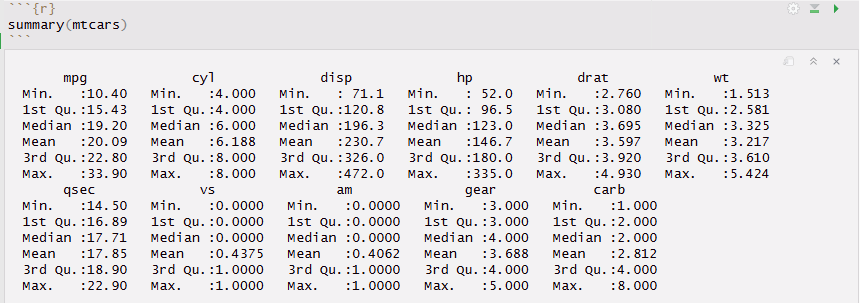
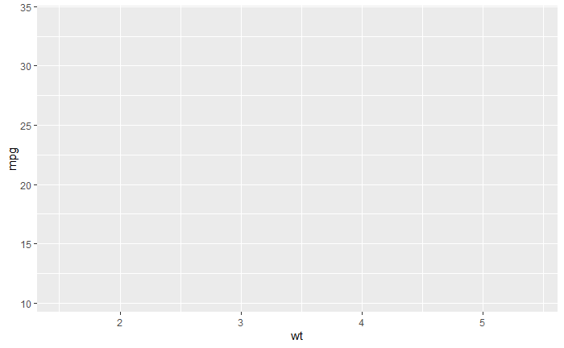
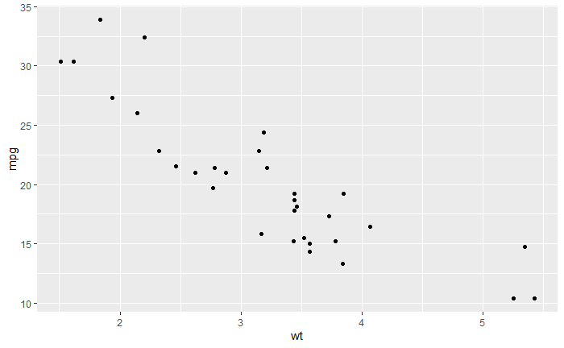
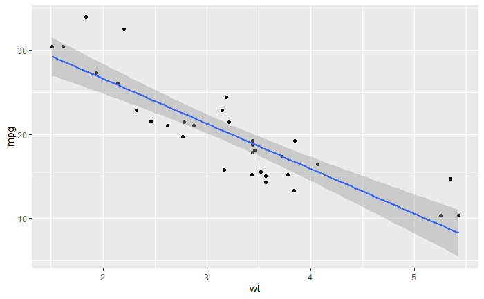
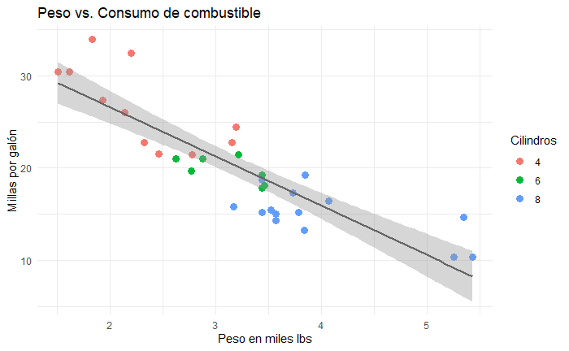

# Introducción a R
{: .no_toc }

## Tabla de Contenidos
{: .no_toc .text-delta }

1. TOC
{:toc}

---

## ¿Qué es R?

R es un entorno y lenguaje de programación con un enfoque al análisis estadístico.

Nació como una reimplementación de software libre del lenguaje S, adicionado con soporte para ámbito estático. Se trata de uno de los lenguajes de programación más utilizados en investigación científica.

{: .important}
>Así como en Python, en R también tendremos paquetes, en un número más acotado que Python. 
> El listado completo lo encontramos acá: [cran.r-Project](https://cran.r-project.org/web/packages/available_packages_by_date.html)

---

## ¿Cuándo usar R?

La respuesta (que es personal) a esta pregunta queda orientada a proyectos donde el centro del proyecto es el **análisis estadístico o la visualización de datos**.

A su vez, si alguna vez deben hacer algún deploy de un dashboard o sacar el output de un flujo y compartirlo de forma que sea interactivo `R Shiny` es un paquete sencillo de implementar para llegar a compartir algo vinculado no tanto con aplicación de modelos si no con visualizar datos.

Por lo tanto, dos lugares comunes que se visualizan con R son:

- Entornos académicos o de investigación (quizás más orientado a las ciencias sociales).
- Se trabaja con datos tabulares y el flujo es principalmente exploración, transformación y modelado, sin necesidad de salir más allá de esa caja.

{: .highlight}
En resumen, para análisis estadístico puro, R suele requerir menos código y ofrecer más herramientas de forma nativa que las que puede brindar Python. En la práctica, no son excluyentes y pueden aparecer soluciones mixtas.

## Diferencias principales con Python

Se detallan en este apartado un listado meramente descriptivo con cosas a tener en cuenta como diferencias significativas en el uso del lenguaje como tal.

### Asignación de variables

En R la asignación se hace con `<-` en lugar de `=`. Si bien `=` también funciona, por convención y estilo se prefiere `<-`.

```r
x <- 10
nombre <- "Juan"
```

### Indexación

A diferencia de Python, en R los índices **arrancan desde 1**, no desde 0. Esto es fuente de confusión frecuente al principio.

```r
v <- c(10, 20, 30)
v[1]  # devuelve 10, no 20
```

### Tipos de datos propios

R tiene algunos tipos de datos que no tienen equivalente directo en Python y que conviene conocer:

- **Vector**: es la unidad básica de R. No existe el escalar como tal; un número suelto es un vector de longitud 1.
- **Factor**: representa variables categóricas. Internamente guarda enteros con etiquetas, lo que lo hace eficiente para modelado estadístico.
- **Data Frame**: equivalente al `DataFrame` de pandas, pero nativo en R desde sus orígenes.

### Uso del Pipeline

R incorpora el operador `|>` (pipe nativo desde R 4.1) para encadenar operaciones, evitando variables intermedias y mejorando el código, haciéndolo más legible. **Antiguamente este operador era `%>%` , que lo van a ver mucho si leen código viejo. Personalmente, sigo usando `%>%`, pero ambas variantes son la misma cosa.

```r
datos |> filter(edad > 30) |> select(nombre, edad)
# es equivalente a:
select(filter(datos, edad > 30), nombre, edad)
```

Si leen ambas variantes, resulta más natural la primera, donde partimos del objeto grande al cual le vamos aplicando funciones, una cadena que suele ser al declararlo de la manera "natural".

### Gramática en gráficos

La visualización en R suele hacerse con `ggplot2`, que implementa el concepto de *[Grammar of Graphics](https://stat20.berkeley.edu/summer-2025/2-summarizing-data/03-a-grammar-of-graphics/tutorial.html)*: los gráficos se construyen por capas, sumando componentes con `+`. Es un paradigma distinto al de `matplotlib` y requiere un cambio en el "chip" en cómo pensar los gráficos, pero así como con los pipelines, resulta algo más expresivo y natural.

```r
ggplot(datos, aes(x = edad, y = ingreso)) + #Indiquemos como vincular nuestros datos con los aesthetics del grafico
  geom_point() + #Declaremos la geometría de nuestro grafico en función de los datos
  geom_smooth(method = "lm") # Le agregamos una regresión lineal al grafico
```

## Ecosistema de paquetes

Al igual que Python, R tiene su propio repositorio central de paquetes: **CRAN** (Comprehensive R Archive Network). Al escribir esto, cuenta con más 20.000 paquetes disponibles, aunque en la práctica el conjunto que se usa en ciencia de datos es bastante más acotado.

El núcleo está dado por **[tidyverse](https://tidyverse.org/)** a nivel de análisis de datos. `tidyverse` cuenta con varios módulos. Debajo se indican varios de ellos y sus análogos de Python.

| Tarea | R (tidyverse) | Python |
|---|---|---|
| Manipulación de datos | `dplyr` | `pandas` |
| Transformación/reshape | `tidyr` | `pandas` |
| Visualización | `ggplot2` | `matplotlib` / `seaborn` |
| Lectura de archivos | `readr` | `pandas` |
| Datos de fechas | `lubridate` | `datetime` / `pandas` |
| Modelado estadístico | `broom` | `statsmodels` |
| Machine learning | `tidymodels` | `scikit-learn` |
| Strings | `stringr` | `re` / `str` methods |

{: .important}
> El listado completo de paquetes disponibles en CRAN se puede consultar acá: [CRAN Package List](https://cran.r-project.org/web/packages/available_packages_by_date.html)

---

## Entorno de trabajo

El entorno más utilizado para trabajar con R es **RStudio**, un IDE desarrollado por Posit (antes RStudio Inc.) que integra consola, editor de scripts, visualizador de gráficos y gestor de entorno en una sola interfaz. Si usaron en el pasado Python con Anaconda, este vendría a ser su análogo.

Una de las ventajas de RStudio es que la instalación de paquetes se puede hacer directamente desde la interfaz gráfica, sin necesidad de usar la consola: desde el panel *Packages* se puede buscar e instalar cualquier paquete de CRAN con un par de clics. Equivale a correr en la consola:

```r
install.packages("nombre_del_paquete")
```


---

## Ejemplo práctico

Vamos a usar el dataset `mtcars`, que viene incluido en R base. Contiene 32 observaciones con 11 variables sobre automóviles: rendimiento (`mpg`), cilindros (`cyl`), peso (`wt`), potencia (`hp`), entre otras.

### Carga y exploración de datos

```r
# En R base los datasets incluidos se cargan directamente
data(mtcars)

# Primeras filas
head(mtcars)

# Resumen estadístico
summary(mtcars)

# Estructura del objeto
str(mtcars)

# Dimensiones
dim(mtcars)  # 32 filas, 11 columnas

# Correlación entre peso y consumo
cor(mtcars$wt, mtcars$mpg)
```

`summary()` devuelve mínimo, máximo, media, mediana y cuartiles para cada variable numérica, lo que da una primera lectura rápida de la distribución de los datos.


*Figura 1: Output de `summary(cars)`.*

`str()` muestra el tipo de cada columna y una preview de los valores, equivalente a combinar `df.dtypes` y `df.head()` en pandas.

### Visualización

Con `ggplot2` los gráficos se construyen sumando capas. La capa base define los datos y los ejes. Las capas siguientes agregan geometrías, ajustes y estilos.

```r
library(ggplot2)

# Capa base: datos y ejes
ggplot(mtcars, aes(x = wt, y = mpg))
```


*Figura 2: Capa base sin geometría.*

```r
# Agregar puntos
ggplot(mtcars, aes(x = wt, y = mpg)) +
  geom_point()
```


*Figura 3: Scatter plot con `geom_point()`.*

```r
# Agregar línea de tendencia
ggplot(mtcars, aes(x = wt, y = mpg)) +
  geom_point() +
  geom_smooth(method = "lm", se = TRUE)
```


*Figura 4: Incorporación de `geom_smooth()` con regresión lineal.*

```r
# Versión final con etiquetas y color por cilindros
ggplot(mtcars, aes(x = wt, y = mpg, color = factor(cyl))) +
  geom_point(size = 3) +
  geom_smooth(method = "lm", se = TRUE, color = "gray40") +
  labs(
    title = "Peso vs. Consumo de combustible",
    x = "Peso en miles lbs",
    y = "Millas por galón",
    color = "Cilindros"
  ) +
  theme_minimal()
```


*Figura 5: Gráfico final con etiquetas y tema.*

La progresión de capas ilustra la lógica de `ggplot2`: cada `+` agrega un componente independiente, lo que hace que los gráficos sean fáciles de modificar y extender sin reescribir todo.


---
[↑ Volver al índice](./index.md){: .btn .btn-outline }