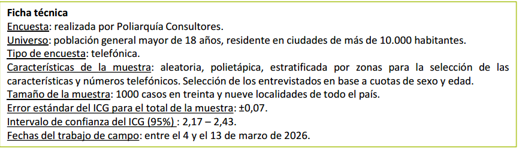

# Introducción a estadística
{: .no_toc }

## Tabla de Contenidos
{: .no_toc .text-delta }

1. TOC
{:toc}

---
## ¿Qué es la estadística?

La estadística es la disciplina que estudia la variabilidad de los fenómenos y los procesos aleatorios que la generan, conforme a las leyes de la probabilidad. 

Distingamos dos ramas:

- **Estadística descriptiva**: descripción, visualización y resumen de datos. Para ello, se apoya en parámetros estadísticos y gráficos o tablas para una representación gráfica.
- **Estadística inferencial**: se ocupa de elaborar conclusiones, generalizaciones o predicciones acerca de una población estadística basándose en el análisis de una muestra estadística representativa

{: .note}
>El término alemán **Statistik**, introducido originalmente por Gottfried Achenwall en 1749, se refería al análisis de datos del Estado, es decir, la «ciencia del Estado» (o más bien, de la ciudad-estado).

A continuación, algunas definiciones que usaremos más adelante a lo largo de la materia, atado a la estadística inferencial.

## Población, muestra y parámetros

**Población**: conjunto o universo de items (objetos, hogares, personas, etc.) de interés. Su tamaño se denota $N$.

**Muestra**: subconjunto de items de la población. Su tamaño se denota $n$.

**Parámetro**: característica específica de la población (valor fijo, generalmente desconocido). **No es una variable aleatoria!**

> **Ejemplo:** Población = todos los hogares de Buenos Aires. Parámetro = ingreso medio de esos hogares.

### ¿Por qué muestrear?

Muestrear consume menos tiempo y recursos que un censo. Además, en muchos casos es prácticamente imposible evaluar todos los items de una población, y aun así es posible obtener resultados con alta precisión a partir de una muestra.

---

## Inferencia estadística

El objetivo de la inferencia estadística es sacar conclusiones sobre algún parámetro desconocido de la población, basándose únicamente en los datos de una muestra. Hay tres tipos principales:

- **Estimación puntual**: proponer un único valor como estimación del parámetro (e.g., usar $\bar{x}$ para estimar la media poblacional $m$).
- **Estimación por intervalos**: proveer un intervalo que, con alta probabilidad, contenga al parámetro (e.g., un intervalo de confianza para $m$).
{: .highlight}
>**¿Cuándo se lee esto?**
> Seguramente vieron en informes o noticias respecto a encuestas

[Ver informe](../img/prob_estadistica/ICG_DiTella_Marzo2026.pdf)
> Esto se lee como pensando que si muestramos 1000 casos muchas veces, el 95% de los intervalos construidos de esa manera contendrían al verdadero valor poblacional del ICG.

{: .important}
> No debe leerse como que hay un 95% de probabilidad de que el parámetro esté en este intervalo. El parámetro poblacional es un valor fijo (recordar que no es una variable aleatoria, como se dijo arriba). Lo aleatorio es el intervalo.

- **Test de hipótesis**: evaluar la evidencia a favor o en contra de una hipótesis sobre el parámetro (por ejemplo, ¿la proporción de hogares con ingreso menor a $50\,000$ es $\geq 0{,}9$?).

{: .important}
>Para una aproximación a este problema, ver [Aplicacion P-Value](./p_valor.md)

---

## Datos de la muestra

En cualquier estrategia de muestreo al azar, las unidades a seleccionar son desconocidas de antemano, por lo que los datos son **aleatorios** antes de ser recogidos.

- $X_i$: variable aleatoria que representa el dato a registrar en la unidad $i$ (antes de recogerlo).
- $x_i$: valor observado en la unidad $i$ (una vez recogido el dato, ya no es aleatorio).

La información completa de la muestra es $X_1, \ldots, X_n$ (antes) o $x_1, \ldots, x_n$ (después).

---

## Estadístico y estimador

**Estadístico**: función de los valores numéricos de las variables de la muestra y, posiblemente, de parámetros poblacionales. Ejemplos: la media muestral, la varianza muestral.

**Estimador**: estadístico que se utiliza para estimar un parámetro poblacional desconocido. Por definición, **no puede depender de los parámetros desconocidos** (de lo contrario no sería computable). Es una variable aleatoria porque depende de $X_1, \ldots, X_n$.

> El **valor estimado** es el número concreto que toma el estimador una vez observada la muestra $x_1, \ldots, x_n$. Ya no es aleatorio.

---

## Parámetros poblacionales

Sea $\mathcal{U} = \{x_1, \ldots, x_N\}$ el conjunto de valores del atributo en la población.

**Media poblacional**

$$m = \frac{1}{N} \sum_{j=1}^{N} x_j$$

**Varianza poblacional**

$$v = \frac{1}{N} \sum_{j=1}^{N} (x_j - m)^2$$

{: .important}
>Los parámetros poblacionales en lo que es la inferencia son desconocidos. No podemos censar a una población demasiado grande o que puede resultar inaccesible en algún caso.

### Media, varianza y desvío de una lista

La media, varianza y desvío estándar de una lista $x_1, \ldots, x_n$ son:

$$\bar{x} = \frac{1}{n} \sum_{i=1}^{n} x_i \qquad \text{Var} = \frac{1}{n} \sum_{i=1}^{n}(x_i - \bar{x})^2 \qquad \text{DE} = \sqrt{\frac{1}{n} \sum_{i=1}^{n}(x_i - \bar{x})^2}$$

### Otros parámetros poblacionales:

- Mediana: valor que divide la distribución en dos mitades iguales.
- Percentiles/cuantiles: la mediana sería un cuantil 50.
- Moda: valor más frecuente.

---

## Muestreo Aleatorio Simple (MAS)

{: .important}
> En un **MAS**, todos los subconjuntos de igual tamaño de la población tienen la misma probabilidad de ser la muestra seleccionada.

**Propiedades clave del MAS:**

- Las $X_i$ son **igualmente distribuidas**: $f_{X_1}(x) = f_{X_2}(x) = \cdots = f_{X_n}(x)$.
- La probabilidad $P(a < X_i < b)$ coincide con la proporción de unidades de la población con valores entre $a$ y $b$.
- Si $n \ll N$, las $X_1, \ldots, X_n$ son **aproximadamente independientes**. Si $N = \infty$, son exactamente independientes.

De ahora en más asumiremos que los datos provienen de un MAS con $n \ll N$, por lo que trataremos a $X_1, \ldots, X_n$ como **i.i.d.** (independientes e idénticamente distribuidas).

En un MAS se verifica además que $\mu_X = m$ y $\sigma^2_X = v$ (los parámetros de la distribución de cada $X_i$ coinciden con los parámetros poblacionales).

---

## Media muestral

La **media muestral** es el estimador natural de la media poblacional:

$$\bar{X} = \frac{1}{n} \sum_{i=1}^{n} X_i$$

A la distribución de $\bar{X}$ se la llama **distribución muestral de la media muestral**.

> 
> - $\bar{X}$: media muestral (variable aleatoria, antes de observar la muestra).
> - $m$: media poblacional (valor fijo desconocido).
> - $\bar{x}$: media de los datos observados (valor numérico, no aleatorio).

### Propiedades de la media muestral

Para $X_1, \ldots, X_n$ i.i.d.:

**Esperanza** — la media muestral es un estimador **insesgado** de la media poblacional:

$$\mu_{\bar{X}} = E(\bar{X}) = \mu_X$$

**Varianza** — a mayor tamaño de muestra, menor variabilidad del estimador:

$$\sigma^2_{\bar{X}} = \text{Var}(\bar{X}) = \frac{\sigma^2_X}{n}$$

---

## Un ejemplo con el INDEC

Hagan una relectura de cada una de las definiciones, y veamos los conceptos aplicados a algo real, como puede ser el INDEC buscando estimar el salario promedio en Argentina.

**Población**: todos los trabajadores registrados del país ($N$ desconocido, del orden
de millones). Evaluar a cada uno sería un censo: costoso e impráctico.

**Parámetro**: la media poblacional $m$, el salario promedio verdadero. Es un valor
fijo pero **desconocido**.

**Muestra**: el INDEC selecciona $n$ trabajadores mediante un MAS (o diseño
equivalente). Antes de relevarla, los salarios $X_1, \ldots, X_n$ son variables
aleatorias i.i.d. con media $\mu_X = m$ y varianza $\sigma^2_X = v$.

**Estadístico / Estimador**: la media muestral

$$\bar{X} = \frac{1}{n} \sum_{i=1}^{n} X_i$$

es el estimador de $m$. Es una variable aleatoria: si el INDEC repitiera el muestreo,
obtendría un $\bar{x}$ distinto cada vez.

**Valor estimado**: una vez relevada la muestra, se obtiene el número concreto
$\bar{x}$ (e.g., $\$800.000$). Ya no es aleatorio: es la realización del estimador.

## ¿Qué distribución sigue la media muestral?

Sabemos que $\bar{X}$ es un buen estimador de $\mu_X$, pero surge conocer cuál es la distribución que sigue el estimador:
**¿qué tan cerca cae $\bar{X}$ de $\mu_X$ en la práctica?** ¿Y qué forma tiene su
distribución? 

### Ley de los Grandes Números (LGN)

El primero responde **qué pasa con $\bar{X}$ cuando $n$ crece**: garantiza que el
estimador converge al parámetro verdadero. Es decir, muestrear más siempre ayuda.

Si $X_1, \ldots, X_n$ son i.i.d. (independientes e identicamente distribuidas) con esperanza $\mu_X$, entonces para cualquier $\varepsilon > 0$:

$$P\!\left(\left|\bar{X} - \mu_X\right| < \varepsilon\right) \xrightarrow{n \to \infty} 1$$

> **Interpretación:** con muestras grandes, la media muestral cae cerca de la media
> poblacional con probabilidad muy alta. Si repitiéramos el muestreo $M = 100\,000$
> veces, en la gran mayoría de los casos obtendríamos $\bar{X} \approx \mu_X$.

### Teorema Central del Límite (TCL)

La LGN dice que $\bar{X}$ se acerca a $\mu_X$, pero no dice **con qué forma**. El TCL completa el cuadro: nos dice que esa distribución es aproximadamente Normal, lo que permite construir intervalos de confianza y hacer inferencia sin conocer la distribución original de la población.

{: .important}
> Para $n$ grande, independientemente de la distribución de las $X_i$:

$$Z = \frac{\bar{X} - \mu_X}{\sigma_X / \sqrt{n}} \xrightarrow{d} \mathcal{N}(0, 1)$$

Equivalentemente: $\bar{X} \underset{\text{aprox}}{\sim} \mathcal{N}\!\left(\mu_X,\,
\frac{\sigma^2_X}{n}\right)$ para $n$ suficientemente grande (regla práctica: $n \geq 30$).

### ¿En qué contexto entra la ciencia de datos?

Veremos más adelante que los modelos se entrenan y se computan métricas de error promedio (MSE, MAE) sobre un conjunto de test, y ese promedio es una media muestral. El TCL garantiza que ese estimador del error verdadero es aproximadamente Normal, lo que permite construir intervalos de confianza para el error y comparar modelos con rigor estadístico.

En este caso, las $X_i$ son los errores de individuales que calculamos en cada conjunto de test, y validamos tener $X_i$ i.i.d, por lo que podemos aproximar la distribución de la media del error a una $N(0,1)$

---

[↑ Volver al índice](./index.md){: .btn .btn-outline }